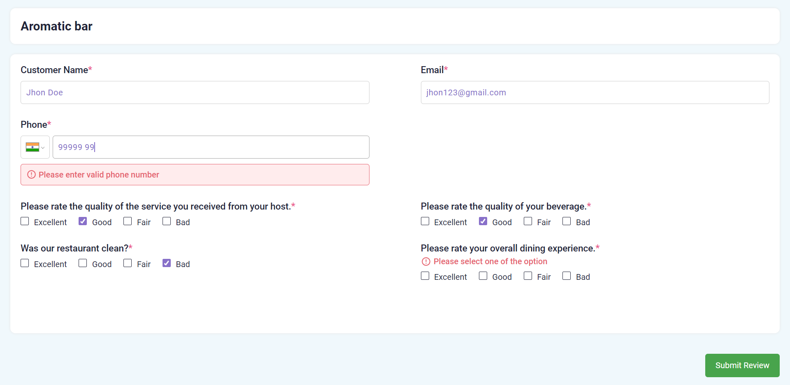
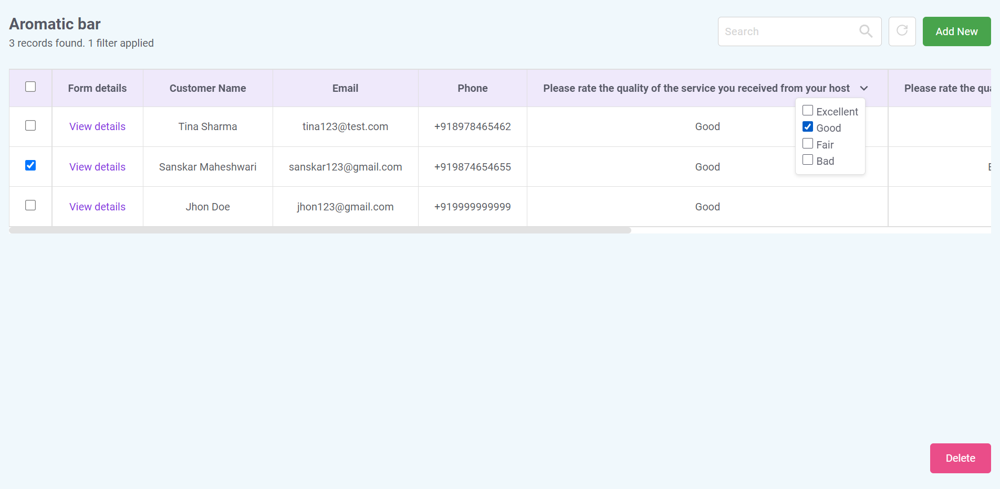
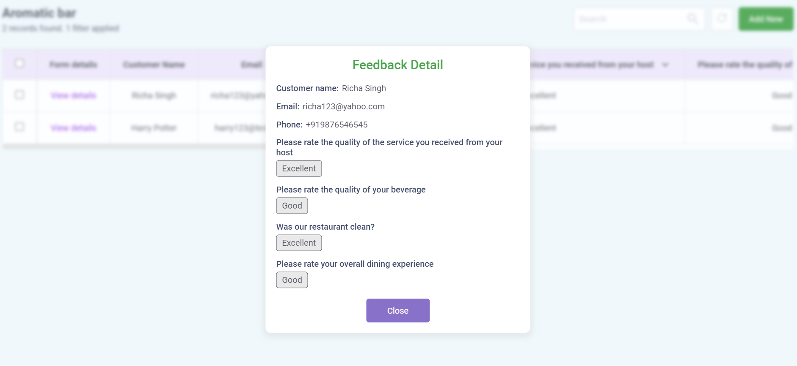

# Restaurant feedback page using React.js

This guide explains the procedure to setup project and also gives brief understanding about project.

React | React Context Api | React Hooks | HTML | CSS

## Overview

This is a simple and user-friendly restaurant feedback collection app where customer can fill their personal information (name, email and phone number) and also provide their feedback by choosing options against each questions.
It also show all feedbacks detail data in table format where we filter data by search, by dropdown column filters.

### Feedback form

### Feedback data list

### Feedback detail modal

## Setup

- To create react project, using create-react-app.
- Packages used:
  - Icons: react-icons (npm install react-icons --save)
  - Phone number: react-phone-number-input (npm i react-phone-number-input)

## Features

- Feedback form to collects customer information and their feedbacks by choosing options against each question.

- Validating form input fields and also show error message. Where all input fields are mandatory.

- On clicking submit button it shows success pop-up message.

- On clicking "Close" button on success modal, it redirects to feedbacks data list tab.

- Feedbacks data shown in tabular format where each row represent customer feedback with "View detail" button.

- On clicking "View detail", it shows Feedback detail information modal.

- Select one, more or all feedback rows and delete them by clicking "Delete" button.

- Filter feedback data by search and dropdown column filter.

- Reset filter by clicking on reset button.

- Add feedback by clicking on "Add new" button, which redirects to feedback form tab.
